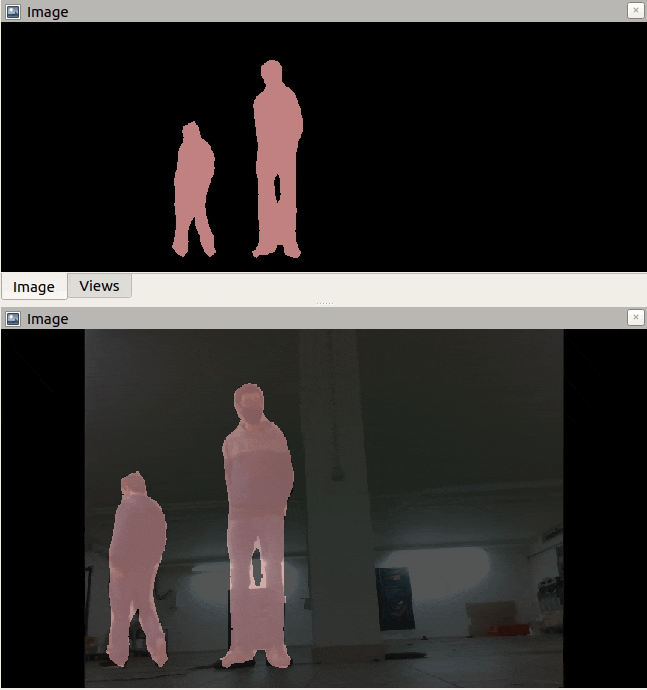

# Object Detection

This package performs detection and tracking of several objects using two distict models, the state of the art You Only Look Once (YOLO) and DeepLab deep learning model.

# Yolo Model

This package performs detection of objects using the state of the art You Only Look Once (YOLO) and for tracking we use the Alex Bewley SORT implementation. For more information about YOLO, Darknet and SORT algorithm see the following links: [YOLO: Real-Time Object Detection](http://pjreddie.com/darknet/yolo/), [Alex Bewley SORT implementation](https://github.com/abewley/sort), [SORT paper](https://arxiv.org/abs/1602.00763).

Based on the [COCO](http://cocodataset.org/#home) dataset we can detect 80 classes:

- person
- bicycle, car, motorbike, aeroplane, bus, train, truck, boat
- traffic light, fire hydrant, stop sign, parking meter, bench
- cat, dog, horse, sheep, cow, elephant, bear, zebra, giraffe
- backpack, umbrella, handbag, tie, suitcase, frisbee, skis, snowboard, sports ball, kite, baseball bat, baseball glove, skateboard, surfboard, tennis racket
- bottle, wine glass, cup, fork, knife, spoon, bowl
- banana, apple, sandwich, orange, broccoli, carrot, hot dog, pizza, donut, cake
- chair, sofa, pottedplant, bed, diningtable, toilet, tvmonitor, laptop, mouse, remote, keyboard, cell phone, microwave, oven, toaster, sink, refrigerator, book, clock, vase, scissors, teddy bear, hair drier, toothbrush

## Node: yolo_detection.py

This node implements the YOLO model to perform the detection of objects.

### Subscribed Topics:

- **`image`** ([sensor_msgs/Image])

  The RGB camera image.
  
- **`camera_info`** ([sensor_msgs/Image])

  The RGB camera info.
  
- **`depth_image`** ([sensor_msgs/Image])

  The Depth camera image.
 
### Published Topics:

- **`output_image`** ([sensor_msgs/Image])

  The RGB image with the bounding_boxes drawn.

- **`bounding_boxes`** ([object_tracking/BoundingBoxes])

  The bounding box for each object detected in the video.

### Parameters:

- **`name`** ([String])
  
  YOLO version name

- **`weigths_path`** ([String])
  
  YOLO weigths path

- **`config_path`** ([String])
  
  YOLO config path

- **`input_size`** ([List of ints])
  
  New input size

- **`model_mean`** ([List of ints])
  
  Scalar with mean values which are subtracted from channels.

- **`scale`** ([float])
  
  Multiplier for frame values..

- **`model_swapRGB`** ([boolean])
  
  Swaps the Red and Green channels.

- **`model_crop`** ([boolean])
  
  Flag which indicates whether image will be cropped after resize or not.

- **`conf_threshold`** ([float])
  
  A threshold used to filter boxes by confidences.

- **`nms_threshold`**([float])
  
  A threshold used in non maximum suppression.

- **`classes`** ([list of Strings])
  
  List of classes detected by the model

## Node: sort_tracking.py

This node implements the SORT algorithm to track the objects provided by the yolo_detection node.

### Subscribed Topics:


- **`image`** ([sensor_msgs/Image])
  The RGB camera image.

- **`bounding_boxes`** ([object_tracking/BoundingBoxes])
  The bounding box for each object detected in the video.

- **`camera_info`** ([sensor_msgs/CameraInfo])
    The RGB camera info.

- **`depth_image`** ([sensor_msgs/Image])
  The depth camera image.

### Published Topics:

- **`output_image`** ([sensor_msgs/Image])

  The RGB image with the bounding_boxes drawn, and the objects id.

- **`object`** ([object_tracking/Object_Info])

  The class of the object, contains the id, class, color, shape, bounding box, speed, real coordinates relative to the camera.

### Parameters:

- **`sort_threshold`** ([float])

  Minimum IOU for match.

- **`min_hits`** ([int])

  Minimum number of associated detections before track is initialised.

- **`max_age`** ([object_tracking/BoundingBoxes]) ([int])

  Maximum number of frames to keep alive a track without associated detections.

- **`blur_humans`** ([boolean])

  The option to blur the detected humans.
  
- **`draw_speed`** ([boolean])

  The option to draw the x,y,z speed of the detected objects.

# DeepLab Model

This package delivers a customizable wrapper of the DeepLab deep learning model for ROS. In order to use this package, you must have an pre-trained model of DeepLab and provide have to [configuration file](cfg/deeplab/deeplabv3_mnv2_vocpascal.yaml) which defines the model's properties (such as detection classes, the frozen inference graph, etc.),

For more information about DeepLab, see the following links: [DeepLab: Deep Labelling for Semantic Image Segmentation](https://github.com/tensorflow/models/tree/master/research/deeplab)

## Node: Deeplab_detection.py

This node implements the Deeplab model to perform the segmentation of objects.

### Subscribed Topics

- **`image`** ([sensor_msgs/Image])
  The RGB camera image.

### Published Topics

- **`output_image`** ([sensor_msgs/Image])

  The segmentation map overlaped with the RGB image.

- **`output_segmap`** ([sensor_msgs/Image])

 The segmentation map.


### Parameters

- **`path`** ([String])
  
  Path to the frozen inference graph

- **`input_size`** ([List of ints])
  
  New input size

- **`input_bgr`** ([boolean])
  
  Swaps the Red and Green channels.

- **`classes`** ([List of Strings])
  
  List of classes detected by the model

# Demos

The rosbags were recorded with a RealSense D435i at 30fps.

## YOLOv4


## Deeplab




# Performance

The tests were measured with the pre-recorded `people_0.bag` and `people_1.bag` at 30 FPS. The table shows the average FPS of several models to each testbench.

| Testbench                                | YOLOv4 | YOLOv3 | YOLOv3-tiny | DeepLab VOC-PASCAL | DeepLab ADE20k |
| :-------------------------------------   | :----: | :----: | :---------: | :---------------: | :-------------: |
| CPU: Ryzen 3700x, RAM:16GB, GPU: RTX3070 | 30     | 30     | 30          | 30                | 29.2            | 
| i5-7440HQ CPU @ 2.80GHz, RAM:8GB         | 2.39   | 3.89   | 26.67       | 2.60              | 1.65            |
| Jetson Xavier (8GB)                      | 7.28   | 6.77   | 29.45       | NaN               | NaN             |


# Basic Usage

## YOLO

First you must download the config and weigth files of the desired model, you can download them [here](https://mega.nz/folder/apZlFAZY#hAD2Dw5YeRCp3xd96Y41QA).

You can adjust the parameters of each node in the respective YAML file, like in [this](cfg/yolo/yolov3-tiny.yaml) example for the `yolov3-tiny` model.
Then you can launch [this](launch/object_tracking.launch) launch file, remap some parameters to match your use case and change some arguments like **`with_camera`**. The YOLO model always tries to load the YOLOv4 model, if CUDA it's not installed in the system it will load a lighter model, you can change the argument **`yolo_default_model`** in the launch file to overwrite this.

```bash
  roslaunch object_detection object_tracking.py with_camera:=true
```

## DeepLab
You can adjust the parameters of each node in the respective YAML file, like in [this](cfg/deeplab/deeplabv3_mnv2_vocpascal.yaml) example for the `
deeplabv3_mnv2_vocpascal` model.
Then you can launch [this](launch/deeplab_segmentation.launch) launch file, remap some parameters to match your use case and change some arguments like **`with_camera`**. The default DeepLab model is `deeplabv3_mnv2_vocpascal`, but this behaviour can be changed by changing the `deeplab_model` argument. You can also use your own pre-trained model, as long as you write an adequate YAML configuration (use [this](cnf/deeplab/deeplabv3_mnv2_vocpascal.yaml) as an example). To properly run the DeepLab node, your computer will need to support GPU aceleration, otherwise heavy performance losses are to be expected.

```bash
  roslaunch object_detection deeplab_segmentation.launch with_camera:=true deeplab_model:="deeplabv3_mnv2_vocpascal"
```
